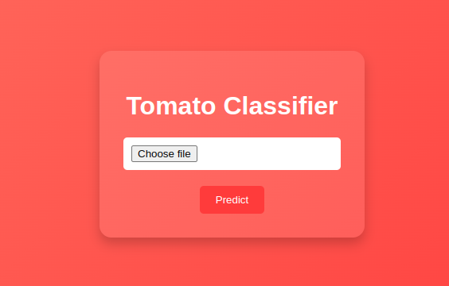
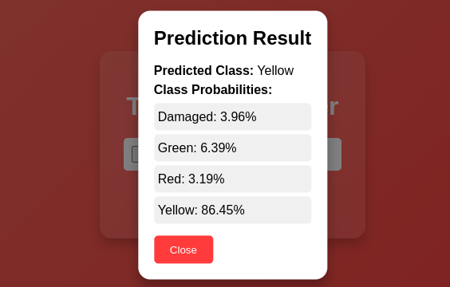

# 🍅 Tomato Ripeness Prediction App

A Django-based web application that predicts the ripeness of tomatoes using image uploads and machine learning. Built to assist farmers, grocers, and researchers in making data-driven decisions for better crop management.

---

## 🌟 Features

- Predicts tomato ripeness from uploaded images using a trained ML model.
- Simple and intuitive UI built with Django templates.
- Handles uploaded images and stores them securely.
- Portable and scalable for various environments.

---

## 🚀 Technologies Used

- **Backend:** Django 3.2
- **Frontend:** HTML, CSS, JavaScript
- **Machine Learning:** TensorFlow/Keras (or specify your library)
- **Database:** SQLite (or your chosen database)
- **Other Tools:** Python Decouple, OpenCV etc.

---

## 🛠️ Installation and Setup

Follow these steps to set up and run the project locally:

1. **Clone the repository:**
   ```bash
   git clone https://github.com/yourusername/tomato_Prediction.git
   cd tomato_Prediction
   ```

2. **Create and activate a virtual environment:**
   ```bash
   python -m venv venv
   source venv/bin/activate   # For Linux/Mac
   venv\Scripts\activate      # For Windows
   ```

3. **Install dependencies:**
   ```bash
   pip install -r requirements.txt
   ```

4. **Set up environment variables:**
   - Create a `.env` file in the root directory and add:
     ```env
     DJANGO_SECRET_KEY=your_secret_key
     DJANGO_DEBUG=True
     ```

5. **Apply migrations:**
   ```bash
   python manage.py migrate
   ```

6. **Run the server:**
   ```bash
   python manage.py runserver
   ```

7. **Access the app:**
   Open your browser and go to `http://127.0.0.1:8000`.

---

## 📸 Screenshots





---

## 🤖 Machine Learning Model

- **Model Type:** (e.g., CNN, ResNet)
- **Dataset:** The dataset used for training was collected manually and curated by the author. It contains images of tomatoes at various stages of ripeness, along with labels indicating their ripeness level..
- **Accuracy:** Include model accuracy and key performance metrics.

---

## 💡 Usage

1. Upload a clear image of a tomato.
2. View the prediction result for ripeness level.
3. Use insights for farming or inventory decisions.

---

## 🖍️ To-Do List

- [ ] Enhance UI/UX with modern designs.
- [ ] Add support for multiple image uploads.

---

## 🤝 Contributing

1. Fork the repository.
2. Create a new branch:
   ```bash
   git checkout -b feature-branch
   ```
3. Commit your changes:
   ```bash
   git commit -m "Add your message"
   ```
4. Push to the branch:
   ```bash
   git push origin feature-branch
   ```
5. Open a pull request.

---

## 🛡️ License

## License
This project is licensed under the MIT License. See the [LICENSE](LICENSE) file for details.

---


